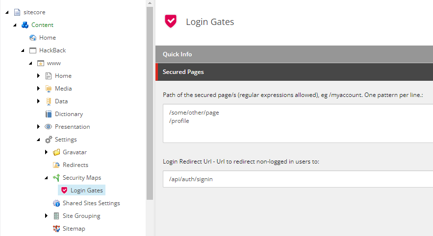

# Hackathon Submission Entry form

## Team name
Bring Back the Hack

## Category
 Best Enhancement to SXA Headless
 


## Description
SXA Headless - Account Module and Secured Pages

Logging in using external identity providers (google, github etc) to access gated content is a common usage pattern users engage with every day.  Among other applications, it is a reliable starting point for gathering user data, tracking their journey through a site,  optimizing for maximum engagement.

This module implements complete implemntation of Authentication and Authorization for Sitecore that is still minimal and ready to be built upon and customized.

### Features
- Integration with external authentication provider - GitHub, out of the box and can be readily expanded with other any providers offered by [NextAuth.js](https://next-auth.js.org/).

  

- Control what areas of the website are secured/gated from Site setting area in CMS

   

- Building custom NextJs middleware using Sitecores middlware plugin architecutre to determine whether the user have access to the requested page. [Edge Middleware Reference](https://vercel.com/docs/concepts/functions/edge-middleware/middleware-api)

- Implement caching on top of GraphQl to query the secured pages mapping less frequently, and have the majority of the work done on Edge runtime
- Extending SXA toolbox to include Account related components
- Integration with Gravatar - Globaly Recognizable Avatars ([Link](https://en.gravatar.com/)).  And ability to further configured it to match sites look and feel:
    

## Video link
⟹ Provide a video highlighing your Hackathon module submission and provide a link to the video. You can use any video hosting, file share or even upload the video to this repository. _Just remember to update the link below_

⟹ [Video Walkthrough](https://www.youtube.com/watch?v=biRkkxsGiAw)

## Pre-requisites and Dependencies
We are using local containarized environment, everything you need is already configured inside the repo and should be automatically installed when you finish the installation instructions
- Uses docker - so no need to configure it.


## Installation instructions
### To start application

1. Ensure you are ready for docker with these prerequesites
    * NodeJs 16.x
    * Visual Studio 2019+/ Visual Code
    * Docker for Windows, with Windows Containers enabled
2. Copy or Clone this Git repo locally
3. Add your Sitecore **license.xml** file under .\license\ folder
5. If your local IIS is listening on port 443, you'll need to stop it. This requires an elevated PowerShell or command prompt.
   ```
   iisreset /stop
   ```
5. run powershell script from repositories root 
    ```
    \.init.ps1
    ```
6. run powershell script from repositories root. This will also load prompt sitecore login to authroize auto CLI items sync
    - if the script fails the first time, trying re-running .\down.ps1 then .\up.ps1

    ```
    .\up.ps1
    ```
7. if Sitecore Cli does not finish correctly or you didn't login to sitecore before it times out, then you need to run the following
    ```
    dotnet sitecore ser push
    ```

### To shut down the application
1. Execute powershell script from project root folder 
    ```
    .\down.ps1
    ```

After these steps run successfully you are ready to go. up.ps1 should take care of pushing serialized templates/rendering/items to CM

### Extensibility

**Extending SSO providers**

More Next-Auth SSO Providers can be added by modifying this file /src/Sites/www/nextjs/src/pages/api/auth/[...nextauth].ts file

### Configuration

#### Gravatar Configuration
Module allows users to configure the Gravatar options (default image, and rating filter) on the User Login component's datasource item.

## Usage instructions

### Login with Github account and test secured/gated pages
1. Open up browser and navigate to https://www.hackback.localhost/
2. on the top left menu, click on Page, This page is available for the public.
3. On the top left menu, click on profile, this page is secured and will navigate you to Github login screen
4. After filling your github credintials, you will be redirected back to the site, Click on Profile link again and you should be able to view your profile


### Configuring other secured pages within Sitecore CMS
This module allow content authors to lock down specific pages or entire path behind login , to configure that follow these steps:
1. Open up browser and navigate to https://cm.hackback.localhost/sitecore/shell , login with admin/b
2. Inside content Editor, navigate to /sitecore/content/HackBack/www/Settings/Security Maps/Login Gates

3. In "Path of the secured page" field, type in the path/s (or regularExpression/s) you want to lock behind login, you can enter multiple lines
4. in "login Redirect Url" type in "/api/auth/signin" - When users without Authorization attempt to access gated pages they will be redirected here.
5. Save and publish
6. To test the newly configured secure path/s, Navigate to https://www.hackback.localhost/, make sure you are logged off
7. Then navigate to the path you configured, you should be redirect back to login page
    Make sure you created dummy page that match the path you configured

## Components
This SXA enchancement comes with two extensible and reusable renderings.

### User Login
To unauthenticated users this component shows up as login button.


While for authenticated users it will display Gravatron profile picture as configured on content manager and an option to sign out. 


### User Profile

This exposes the Next Auth session and user object. This React component can be tailored as desired.


